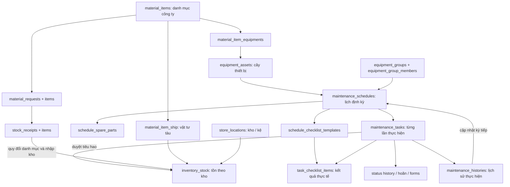

# Rà soát bảng dữ liệu PMS — 02/10/2026

## Phạm vi và bằng chứng

Đã đọc schema, khóa ngoại, unique index và đếm dòng trực tiếp trong hai database local đang chạy:

- Edge: container `maritime-edge-postgres`, database `maritime_edge`.
- Shore: container `shore_product-postgres-1`, database `productdb`.
- Mọi truy vấn database dùng transaction `READ ONLY`; không thay đổi schema hoặc dữ liệu.
- Kiểm tra lại không phân biệt chữ hoa/thường tìm được **28 bảng liên quan ở Edge**, gồm cả `"MaterialReceipts"` và `"MaterialReceiptItems"` mà lần đếm 26 bảng trước đã bỏ sót. `equipment_assets` có 1 dòng, 27 bảng còn lại trống. Shore có 18 bảng được đối chiếu: 1 thiết bị, các bảng còn lại trống, bao gồm `"MaintenanceTasks"`.

Đây là database local, không xác nhận dữ liệu trên server đang phục vụ giao diện trong ảnh. Kết luận về mức sử dụng dựa thêm vào route, controller/service, EF mapping và luồng đọc/ghi; không coi bảng trống là bảng thừa. Đã biên dịch công cụ tạm để đọc trực tiếp metadata `EdgeDbContext.Model`, xác nhận tên bảng/FK/thuộc tính sync mà không mở kết nối database. Chưa chạy kiểm thử giao dịch hoặc mô phỏng lỗi cạnh tranh.

## 1. Các module trong menu dùng bảng nào?

| Module | Bảng chính | Tương tác |
|---|---|---|
| Quản lý thiết bị | `equipment_assets`, `equipment_groups`, `equipment_group_members` | `parent_id` tạo cây; group/member gom thiết bị theo nhóm dùng lịch chung. Counter nằm ở asset và ảnh hưởng lịch/task. |
| Quản lý vật tư | `material_item_ship`, `material_items`, `material_categories`, `material_item_equipments` | Danh mục công ty ở `material_items`; vật tư tàu ở `material_item_ship`, nối danh mục qua `material_item_code` → `item_code`; bảng nối vật tư–thiết bị hiện tham chiếu danh mục công ty. |
| Quản lý kho | `store_locations` | `parent_id` tạo Kho → khu/kệ; vị trí được phiếu nhập và tồn kho sử dụng. |
| Yêu cầu vật tư | `material_requests`, `material_request_items` | Dòng yêu cầu tham chiếu danh mục công ty, có thiết bị liên quan và số lượng yêu cầu; phiếu nhập có thể nối yêu cầu. |
| Phiếu nhập kho | `stock_receipts`, `stock_receipt_items` | Hoàn tất phiếu quy đổi danh mục sang vật tư tàu, cộng `inventory_stock` theo vị trí và `material_item_ship.on_hand_quantity`. |
| Tồn kho | `inventory_stock`, `material_item_ship`, `store_locations` | Bảng tồn lưu lượng từng vật tư tàu tại từng vị trí; số tổng còn lưu trên vật tư tàu. Lịch sử nhập/xuất được tổng hợp từ phiếu và thông tin tiêu hao bảo trì. |
| Danh sách công việc — cấu hình | `maintenance_schedules`, `schedule_checklist_templates`, `schedule_spare_parts` | Lịch gán thiết bị/nhóm; checklist và vật tư là yêu cầu dự kiến cho kỳ bảo trì. |
| Danh sách công việc — thực hiện | `maintenance_tasks`, `task_checklist_items`, `task_status_history`, `task_deferral_requests`, `task_risk_assessments`, `task_inspection_reports`, `maintenance_histories` | Task là từng lần làm; checklist là kết quả thực tế; history ghi trạng thái/kết quả; form ghi rủi ro và kiểm tra; duyệt có tiêu hao vật tư, cập nhật lịch kỳ tiếp. |

Lưu ý tên code: `DbSet MaterialItems`/class `MaterialItem` map vào `material_item_ship`, còn `MaterialCatalogItems`/class `MaterialCatalogItem` map vào `material_items`. Đọc tên DbSet mà không đọc mapping rất dễ nhầm.

## 2. Luồng tương tác chính

Sơ đồ thể hiện luồng nghiệp vụ và tham chiếu trong code, không khẳng định tất cả các mũi tên đã được database bảo vệ bằng khóa ngoại.

## 3. Bảng nào có khả năng thừa?

### `maintenance_task_details` — ứng viên dọn rõ nhất

- Hiện trống.
- Tìm trong code Edge ngoài migration chỉ thấy model, DbSet và mapping; không thấy controller/service hiện tại đọc/ghi.
- Luồng checklist hiện dùng `task_checklist_items` với mẫu `schedule_checklist_templates`.
- Có thể lập migration loại bỏ sau khi kiểm tra dữ liệu và client cũ ở môi trường triển khai. Chưa xóa trong lần rà soát.
- Tên `MaintenanceTaskDetailDto` trong API `/api/tasks/{id}` và class Flutter `MaintenanceTaskDetail` không chứng minh bảng này được dùng: endpoint lấy `MaintenanceTasks`, `DeferralRequests`, `StatusHistory` rồi tạo DTO; mobile checklist đọc `task_checklist_items`. Đã phân biệt DTO với entity bảng.
- Script `clear-edge-data.sql` và `reseed-edge-db.sql` còn nhắc bảng này; nếu dọn phải sửa script cùng model/migration.

### `"MaterialReceipts"` và `"MaterialReceiptItems"` — hai bảng vật lý legacy khác bảng viết thường

- Tồn tại ở DB Edge local và hiện trống; bảng items tham chiếu bảng header viết hoa và `material_item_ship`. Không thấy view public tham chiếu chúng.
- Migration `20251209073143_RecreateMaterialReceiptTables` tạo hai bảng viết hoa. Entity có `[Table("MaterialReceipts")]`, nhưng `OnModelCreating` đổi tên sang snake_case; metadata EF thực tế xác nhận model map vào **bảng viết thường**.
- Tìm tham chiếu code hiện tại không thấy đường SQL/runtime riêng đọc ghi cặp viết hoa; script reseed còn gọi chúng. Đây là ứng viên loại bỏ do dấu vết migration, khác với API phiếu cũ vẫn đang sử dụng bảng viết thường.
- Chưa drop ngay: cần kiểm tra database triển khai, phụ thuộc ngoài repo và dữ liệu; nếu được dọn phải drop items trước header bằng migration mới và sửa script reseed. Không sửa/xóa migration lịch sử để giả vờ hai bảng chưa từng tồn tại.

### `material_receipts` và `material_receipt_items` — luồng phiếu nhập cũ cần hợp nhất

- Menu Phiếu nhập kho hiện dùng `stock_receipts`/`stock_receipt_items`.
- Cặp bảng cũ vẫn được `MaterialReceiptService` và API `/api/materials/receipts` sử dụng; frontend gọi chủ yếu từ `oldMaterialPage` và modal liên quan không được route hiện tại nhập vào.
- Service cũ tăng số tồn vật tư tàu nhưng không có luồng cập nhật tồn theo vị trí tương ứng trong service này. Đây là một đường ghi dễ làm lệch tồn.
- Không thể gọi là hoàn toàn không dùng chỉ vì menu không gọi. Cần chuyển dữ liệu và import/client API cũ sang luồng phiếu mới rồi mới bỏ endpoint và bảng cũ.
- Shore còn import `ImportReceiptModal` từ trang MaterialPage được route; modal gọi `/materials/receipts/preview` và `/import`, nhưng không tìm thấy controller tương ứng trong backend Shore hiện tại. Không kết luận đây là luồng đang hoạt động thành công; cần kiểm tra cấu hình proxy/runtime trước khi bỏ service hoặc tuyên bố không còn client.

### Những bảng không nên coi là thừa

- `material_items` và `material_item_ship`: một bảng danh mục chung, một bảng quản lý vật tư từng tàu.
- `equipment_groups`/`equipment_group_members`: code tạo lịch theo nhóm và completion còn đọc; không xóa cùng việc dọn trang PMS cũ.
- `maintenance_schedules` và `maintenance_tasks`: định nghĩa lịch khác từng lần thực hiện.
- `schedule_checklist_templates` và `task_checklist_items`: mẫu khác kết quả và snapshot từng kỳ.
- `maintenance_histories` và `task_status_history`: kết quả thực hiện khác nhật ký chuyển trạng thái. Nên quy định rõ nguồn chuẩn, không xóa chỉ vì thông tin có giao nhau.

## 4. Bảng/quan hệ chưa phản ánh tốt nghiệp vụ

| Ưu tiên | Vấn đề có bằng chứng | Hệ quả và hướng chỉnh |
|---|---|---|
| P1 | `material_item_ship.on_hand_quantity` và `inventory_stock.quantity` cùng lưu số tồn. API sửa vật tư/adjust-stock và import phiếu cũ có thể chỉ sửa số tổng; API điều chỉnh tồn theo vị trí query tổng trước khi lưu thay đổi. | Có đường ghi khiến hai số khác nhau. Chọn tồn theo vị trí làm nguồn chuẩn, số tổng là giá trị tính/cache; cập nhật bằng một service/giao dịch chung. Không kết luận dữ liệu đã lệch vì local đang trống. |
| P1 | Duyệt task trừ từ vị trí có lượng lớn nhất trước, chưa lấy vị trí xuất được người dùng xác nhận; nếu không có dòng tồn thì trừ trực tiếp số tổng. | Không phản ánh chính xác “đã lấy phụ tùng ở kho/kệ nào”. Cần dòng xuất/tiêu hao có vật tư tàu, vị trí, số lượng, task, người, thời điểm; kiểm soát chống ghi hai lần. |
| P1 | Thiếu FK thực tế: `inventory_stock` → vật tư tàu/kho; `stock_receipt_items` → vị trí/vật tư; `material_item_equipments` → thiết bị; `maintenance_tasks` → schedule/asset; `schedule_spare_parts` → schedule; `maintenance_histories` → schedule/task; forms → task. | Có thể tồn tại ID không hợp lệ hoặc bản ghi mồ côi. Thống nhất nghĩa ID danh mục/vật tư tàu của dòng phiếu trước khi thêm FK; làm sạch dữ liệu triển khai rồi thêm ràng buộc. |
| P1 | Unique index Edge thiếu cho cặp group–asset và material–asset; forms chỉ index thường theo `task_id`, không unique. | Code kiểm tra trước insert không thay thế được unique constraint khi có request đồng thời. Bổ sung unique phù hợp nghiệp vụ; nếu form có revision thì unique theo task + revision, không ép một form khi cần nhiều phiên bản. Shore đã có unique cho hai cặp nối này. |
| P1 | `maintenance_schedules` chỉ lưu chu kỳ ngày/giờ; tháng/năm chưa có đơn vị lịch riêng, khoảng giờ/docking/voyage chưa có mô hình riêng. | Chưa biểu diễn đúng mọi chu kỳ trong KHBQBD. Thêm loại trigger, đơn vị chu kỳ, baseline và hạn kế hoạch/nguồn gốc; giữ tương thích lịch cũ. |
| P2 | Task có mã thiết bị chuỗi, UUID asset/group và snapshot tên; checklist/forms dùng mã task trong khi deferral/history dùng UUID. | **Không tự coi khóa chuỗi là sai:** `task_checklist_items.task_id` đã có FK tới alternate key unique `maintenance_tasks.task_id`; mobile còn gọi checklist bằng mã. Chuyển tất cả sang UUID là refactor tùy chọn, không phải điều kiện để sửa lỗi tồn kho. Forms chưa có FK nên cần bảo vệ quan hệ mà giữ hợp đồng web/mobile hiện tại. |
| P2 | Vật tư dùng thực tế/dự kiến còn chứa JSON/text trên task/history, trong khi vật tư dự kiến theo schedule đã có bảng dòng riêng. | Khó ràng buộc mã vật tư, số lượng, vị trí và tổng hợp tiêu hao. Chuẩn hóa dòng tiêu hao; nếu giữ JSON thì coi là snapshot báo cáo, không dùng làm sổ kho duy nhất. |
| P1 | Hai đường lưu nhóm không nhất quán: Create/Update asset và repository GetByGroupId dùng cột `equipment_group_id`; frontend Add/EditAsset gọi API thêm member, API AddAsset chỉ thêm bảng nối; import asset có thêm member. | Có trường hợp cùng một thiết bị xuất hiện trong danh sách membership nhưng không xuất hiện ở API lọc theo cột group. Giữ cả hai trước mắt, sửa hợp đồng read/write theo nghĩa nghiệp vụ đã chốt; chưa có cơ sở drop cột hoặc bảng nối trước khi chuyển hết các consumer. |
| P2 | Danh mục công ty `material_items` không có `part_number`/`unit`; các thông tin này nằm trên `material_item_ship`. | Nếu mã phụ tùng/đơn vị phải thống nhất toàn công ty thì vị trí lưu hiện tại chưa đủ: đưa thuộc tính master lên danh mục, giữ override/snapshot tàu có chủ đích. Cần chốt nghiệp vụ trước migration. |
| P2 | Shore local có `MaintenanceTasks` viết hoa, `inventory_stocks` số nhiều, và không thấy bảng chi tiết checklist task/forms/status history tương ứng Edge. | Không kết luận sync lỗi chỉ vì khác tên; cần kiểm chứng mapping và phạm vi dữ liệu bờ xem được. Việc sync task không đồng nghĩa bờ có đủ chi tiết thực hiện. |

Các số tồn đang dùng decimal ở DB nhưng một số model/DTO dùng double; nên thống nhất kiểu decimal cho lượng vật tư và tiền để tránh sai số tích lũy.

## 5. Bằng chứng code chính

- Mapping danh mục/vật tư tàu: [EdgeDbContext.cs](../../edge_product/edge-services/Data/EdgeDbContext.cs:2070).
- Bảng checklist cũ: [EdgeDbContext.cs](../../edge_product/edge-services/Data/EdgeDbContext.cs:1536).
- Hoàn tất phiếu nhập và quy đổi ID: [StockReceiptController.cs](../../edge_product/edge-services/Controllers/Inventory/StockReceiptController.cs:270).
- Sửa số tổng trực tiếp: [MaterialController.cs](../../edge_product/edge-services/Controllers/Inventory/MaterialController.cs:572).
- Khai báo/điều chỉnh tồn: [InventoryController.cs](../../edge_product/edge-services/Controllers/Inventory/InventoryController.cs:282).
- Duyệt và chọn vị trí trừ vật tư: [TaskWorkflowController.cs](../../edge_product/edge-services/Controllers/Maintenance/TaskWorkflowController.cs:325).
- Luồng phiếu cũ: [MaterialReceiptService.cs](../../edge_product/edge-services/Services/Inventory/MaterialReceiptService.cs:185).
- Menu phiếu hiện tại: [App.tsx](../../edge_product/frontend-edge/src/App.tsx:140).
- Mapping sync PMS về Shore: [SyncInboxService.cs](../../shore_product/backend/Services/Sync/SyncInboxService.cs:231).

## 6. Thứ tự đề xuất

1. Xác nhận schema và dữ liệu trên môi trường sử dụng; kiểm tra lệch tổng tồn/quan hệ mồ côi và client API cũ.
2. Hợp nhất đường ghi nhập/xuất/điều chỉnh kho, thống nhất nguồn số tồn và vị trí xuất.
3. Làm sạch quan hệ, thêm FK/unique có migration phù hợp Edge/Shore.
4. Dọn `maintenance_task_details`; chuyển rồi loại bỏ luồng `material_receipts` cũ nếu không còn client.
5. Chuẩn hóa task ID, dòng tiêu hao, quan hệ nhóm và chu kỳ bảo trì trước khi nhập KHBQBD hàng loạt.

Chưa thực hiện bất kỳ việc xóa bảng hay sửa database nào.

## 7. Kết quả kiểm tra sâu: lỗi cần sửa trước khi đổi schema

### 7.1. Số tổng tồn sai sau API Adjust

`InventoryController.Adjust` sửa `stock.Quantity` trong change tracker, sau đó gọi `SumAsync` trên DB **trước** `SaveChangesAsync`. SQL SUM vẫn đọc lượng cũ. Ví dụ một vị trí từ 10 tăng thêm 2: vị trí được lưu 12 nhưng số tổng có thể vẫn được gán 10. Đây là lỗi đường xử lý cụ thể, không phải lý do xóa bảng `material_item_ship`.

Luồng `Declare` cũng tính tổng trước lần lưu cuối; khi cùng một vật tư khai báo nhiều vị trí trong một batch, tổng các vị trí còn đọc số cũ và dòng cuối có thể ghi đè tổng không đầy đủ. Sửa bằng gom batch, lưu/tính lại trong cùng transaction, hoặc tính từ trạng thái tracked đầy đủ. Đồng thời kiểm tra các đường ghi từ MaterialController/import cũ chỉ thay số tổng.

### 7.2. Phiếu nhập đã hoàn tất vẫn sửa được

`StockReceiptController.Update` không khóa trạng thái Completed; cho cập nhật Status và xóa/thêm lại items mà không đảo/reconcile tồn. Trường hợp Completed → Draft → complete lần nữa có thể nhập cùng phiếu lần hai. Nếu gửi Status=Completed qua Update cũng có thể đánh dấu hoàn tất mà không chạy nhập kho. Cần khóa sửa phiếu đã ghi sổ, chỉ chuyển trạng thái qua endpoint nghiệp vụ; khi sửa lịch sử phải có giao dịch điều chỉnh rõ.

`ResolveShipStockItemIdAsync` gọi `SaveChangesAsync` bên trong vòng hoàn tất phiếu khi tạo vật tư mới, còn Complete không có transaction bao trùm. Điều này có thể flush cả thay đổi của dòng trước trước khi toàn phiếu xử lý xong. Cần transaction, xử lý lỗi cả phiếu và chống hoàn tất đồng thời; không chỉ kiểm tra string Status trước khi ghi.

### 7.3. ID vật tư dòng phiếu có hai nghĩa

`StockReceiptItem.MaterialItemId` trong code resolver chấp nhận cả ID vật tư tàu legacy và ID danh mục, rồi fallback theo ItemCode. Vì vậy **không được thêm ngay FK cột này vào một trong hai bảng**. Trước tiên tách nghĩa bằng field rõ ràng hoặc quy đổi toàn bộ dữ liệu về danh mục; giữ mapping lịch sử và kiểm tra khách hàng API.

ID của vật tư dự kiến theo schedule là ID danh mục (`schedule_spare_parts` FK `material_items`); vật tư thực tế trên WorkReport lấy từ `materialService.getItems`, là ID vật tư tàu và được verify tìm trong `MaterialItems`. Đây là hai nghiệp vụ khác nhau, không phải bằng chứng hai bảng vật tư dư.

### 7.4. Liên kết vật tư–thiết bị không tự sync theo SaveChanges

Metadata EF xác nhận `MaterialItemEquipment` không có `IsSynced`. `ProcessSyncQueue` bỏ qua entity không có thuộc tính này; reconcile thông thường không liệt kê bảng nối. API Assign/Remove/Update equipment chỉ lưu DB, không tự enqueue. Full sync trong SyncController có enqueue bảng này, nên không được kết luận “không có sync”, nhưng luồng thay đổi hàng ngày thiếu đường queue tự động, đặc biệt delete cần được kiểm tra riêng. Đây là lỗi tích hợp cần giải quyết trước khi đổi quan hệ.

`TaskChecklistItem`, `TaskStatusHistory`, `TaskRiskAssessment`, `TaskInspectionReport` cũng không có `IsSynced`, không thấy mapping bảng tương ứng trong Shore inbox. Sync task hiện không chứng minh sync đầy đủ các chi tiết này; phải chốt phạm vi bờ cần xem và thêm cơ chế tương ứng nếu cần.

### 7.5. Quyết định sau kiểm tra

| Hạng mục | Quyết định có căn cứ hiện tại |
|---|---|
| `maintenance_task_details` | Không thấy runtime consumer trong repo; ứng viên loại bỏ cùng script/model sau kiểm tra server. |
| `"MaterialReceipts"`, `"MaterialReceiptItems"` | Cặp physical table legacy không được EF hiện tại map; ứng viên dọn riêng với bằng chứng migration và metadata. |
| `material_receipts`, `material_receipt_items` | Giữ: Edge API/service còn dùng; chỉ loại bỏ sau chuyển client/import và lịch sử. |
| `material_items`, `material_item_ship`, `inventory_stock` | Giữ: ba vai trò master/vật tư tàu/tồn vị trí; sửa đường ghi gây lệch. |
| Cột group và bảng membership | Giữ trong giai đoạn sửa: cả hai còn consumer thật; chốt quan hệ rồi mới migration. |
| Task code và UUID | Giữ tương thích: checklist hiện có FK alternate key và mobile dùng mã; chưa cần refactor hàng loạt. |
| Bảng giao dịch kho/dòng tiêu hao mới | Là đề xuất thiết kế cho audit theo kho, chưa phải kết luận bắt buộc phải tạo ngay. Có thể sửa lỗi Adjust/Complete/transaction/sync trước mà chưa thêm bảng. |

Bằng chứng bổ sung: [GetByGroupIdAsync](../../edge_product/edge-services/Repositories/EquipmentAssetRepository.cs:60), [AddAsset](../../edge_product/edge-services/Controllers/Maintenance/EquipmentGroupController.cs:301), [AddAssetModal](../../edge_product/frontend-edge/src/components/pms/AddAssetModal.tsx:80), [snake_case mapping](../../edge_product/edge-services/Data/EdgeDbContext.cs:234), [migration tạo bảng viết hoa](../../edge_product/edge-services/Data/Migrations/20251209073143_RecreateMaterialReceiptTables.cs:14), [skip entity không sync](../../edge_product/edge-services/Data/EdgeDbContext.cs:3051), [full sync bảng nối](../../edge_product/edge-services/Controllers/Core/SyncController.cs:571).

Kết luận này xác nhận hành vi tĩnh và schema local, không khẳng định các lỗi đã xảy ra trên dữ liệu production. Không xóa bảng, thay schema hoặc nhập dữ liệu trong lần kiểm tra lại.

## 8. Đợt sửa lỗi luồng PMS sau kiểm tra

Đã sửa code theo các lỗi xác định ở mục 7. Những mô tả lỗi phía trên ghi lại trạng thái **trước đợt sửa này**.

| Phần | Thay đổi đã thực hiện |
|---|---|
| Khai báo tồn kho | Nạp tất cả vị trí của vật tư, áp dụng toàn bộ batch rồi tính tổng từ dữ liệu tracked. Các dòng trùng vật tư/vị trí dùng chung một bản ghi; giá trị khai báo cuối cùng có hiệu lực. Kiểm tra vật tư/vị trí hoạt động và số âm trước khi ghi. |
| Điều chỉnh tồn kho | Tính tổng sau khi áp dụng điều chỉnh trong change tracker, bao gồm cả các vị trí không đổi. Giữ hành vi hiện tại: giảm vượt tồn thì lượng tại vị trí về 0. |
| Hoàn tất phiếu nhập | Transaction bao trùm tạo vật tư tàu, cập nhật tồn, phiếu, yêu cầu liên quan và queue sync. Resolver không gọi SaveChanges giữa các dòng; tái sử dụng vật tư/dòng tồn mới đang được tracking. Dòng thực nhập thiếu vị trí hoặc không quy đổi được vật tư làm cả phiếu bị từ chối. |
| Trạng thái phiếu | Giữ bước Draft → Approved. Không cho Update tự gán Completed hoặc quay lại Draft từ Approved. Complete vẫn nhận Draft/Approved như giao diện hiện tại. Chặn sửa/xóa/hoàn tất lại phiếu Completed. Thay items thì xóa collection cũ trước khi thêm collection mới. |
| Hoàn tất đồng thời | Các endpoint Declare/Adjust và Update/Complete/Delete phiếu dùng cùng PostgreSQL advisory lock trong transaction, lấy lock trước khi đọc. Chống ghi hai lần cùng phiếu và mất lượng khi hai phiếu cùng nhập một vị trí. Lock giải phóng khi commit/rollback. |
| Nhóm thiết bị | GetByGroupIdAsync nhận cả membership và cột EquipmentGroupId legacy, không trả trùng thiết bị và vẫn loại thiết bị không hoạt động. |
| Liên kết vật tư–thiết bị | SaveChanges tự enqueue CREATE/UPDATE/DELETE của MaterialItemEquipment dù bảng chưa có IsSynced. Giữ tên bảng sync material_item_equipment theo Shore inbox hiện tại. |

### Kiểm chứng

- Bộ test tổng: **27 passed, 0 failed, 0 skipped** khi chạy với PostgreSQL riêng.
- Thêm 14 test PMS: tồn đa vị trí/batch trùng; từ chối batch lỗi; quy đổi cả ID danh mục và ID vật tư tàu; nhập lần đầu với dòng trùng; khóa phiếu Completed; duyệt phiếu; thay items; truy vấn nhóm theo hai quan hệ; payload queue CREATE/UPDATE/DELETE; rollback và hai tình huống hoàn tất đồng thời.
- Chạy mặc định không có PostgreSQL: 24 passed, 3 test transaction/concurrency được skip có lý do. Các test dùng PostgreSQL yêu cầu biến PMS_TEST_CONNECTION_STRING và database tên codex_pms_tests_* để tránh sử dụng database ứng dụng.
- Build/test xuất ra thư mục riêng vì backend đang chạy giữ executable trong bin/Debug. Những warning cũ ngoài phạm vi vẫn còn.

### Giới hạn của đợt sửa

- Chưa thêm/xóa bảng, cột, FK hoặc migration; không sửa dữ liệu trong database Edge/Shore đang dùng.
- Chỉ các endpoint nêu trên tham gia advisory lock. Luồng nhập cũ MaterialReceiptService, thay số tổng trong MaterialController, xuất vật tư khi duyệt công việc và luồng sync chưa được hợp nhất vào cơ chế này; không coi đây là giải pháp đồng thời cho toàn bộ PMS.
- Các endpoint đã sửa tính OnHandQuantity từ inventory_stock. Dữ liệu legacy chỉ có số tổng mà chưa phân bổ vị trí cần được đối soát/khai báo vị trí trước khi áp dụng trên dữ liệu thực; đợt sửa không tự di chuyển số dư legacy.
- Bổ sung queue cho thay đổi liên kết từ thời điểm triển khai. Các liên kết cũ chưa được gửi vẫn dùng chức năng full sync hiện có; chưa bổ sung reconcile nền cho bảng nối, chưa kiểm chứng truyền HTTP tới Shore trong test này.
- Chưa đổi ý nghĩa hai loại MaterialItemId trên dòng phiếu; giữ khả năng đọc dữ liệu legacy.

## 9. Đợt bổ sung ràng buộc bảng — 02/10/2026

Đã thực hiện theo yêu cầu sửa bảng, sau khi xác nhận danh mục `material_items` từ bờ và vật tư tàu `material_item_ship` là hai vai trò riêng.

| Bảng | Edge | Shore |
|---|---|---|
| Tồn kho | `inventory_stock`: FK tới vật tư tàu/vị trí, check quantity/unit_cost không âm. | `inventory_stocks`: cùng quan hệ, FK vật tư tới MaterialItemShip, không tới danh mục. |
| Liên kết vật tư–thiết bị | Thêm FK thiết bị và unique cặp material_item_id/equipment_asset_id. FK danh mục đã có. | Thêm FK thiết bị; giữ unique và FK danh mục sẵn có. |
| Nhóm–thiết bị | Thêm unique cặp group_id/asset_id; giữ hai FK hiện có. | Giữ unique và hai FK hiện có, không tạo thêm index trùng. |
| Dòng phiếu nhập | Thêm FK vị trí kho nullable. | Thêm FK vị trí kho nullable. |
| Form rủi ro/kiểm tra | FK task_id theo alternate key maintenance_tasks.task_id, giữ mã string. | Chưa có các model form tương ứng; không tạo bảng bờ chỉ để đối xứng. |

Các FK mới dùng RESTRICT: không xóa dây chuyền dữ liệu kho, liên kết hay form lịch sử khi xóa parent. Những FK cũ không bị đổi chính sách.

Migration mới ở cả hai bên: `20261002160604_EnforcePmsRelationalIntegrity`, kèm snapshot cập nhật. Không sửa migration lịch sử. Hai index form đã có trong SQL migration `20260411000000_AddRiskAssessmentAndInspectionReport` nên migration mới dùng CREATE INDEX IF NOT EXISTS và giữ chúng khi rollback.

Migration kiểm tra dữ liệu trước khi thay đổi schema và báo lỗi nếu có số âm, parent mồ côi hoặc liên kết trùng liên quan. Không tự xóa, gộp dòng hay đoán parent. Khi triển khai trên database khác cần đối soát các bản ghi được báo lỗi rồi chạy lại.

Điều chỉnh API đi kèm: kiểm tra vị trí kho khi tạo/sửa phiếu; kiểm tra thiết bị khi gán vật tư; loại ID trùng trong batch gán; trả HTTP 409 khi tạo liên kết/nhóm trùng do yêu cầu đồng thời.

### Kết quả kiểm chứng và áp dụng

- **30/30 test pass trên PostgreSQL**: gồm 27 test trước và 3 test mới kiểm tra FK/unique/check của các bảng đã sửa. Test cũ được chỉnh để vị trí thứ hai có bản ghi parent hợp lệ.
- Tạo bản sao riêng từ database local Edge/Shore, áp dụng migration, rollback và áp dụng lại thành công ở cả hai bên.
- `dotnet ef migrations has-pending-model-changes` xác nhận cả hai snapshot khớp model.
- **Đã áp dụng vào local** `maritime_edge` trong `maritime-edge-postgres` và `productdb` trong `shore_product-postgres-1`. Đã đọc lại history và ràng buộc vật lý; không xóa dữ liệu nghiệp vụ. Database test được dọn sau kiểm chứng.
- Chưa triển khai lên server khác, chưa restart backend đang chạy, chưa commit/push.

### Phần giữ nguyên để tương thích

- Giữ cả hai bảng danh mục/vật tư tàu và FK theo mã danh mục. Không đổi hướng sở hữu danh mục từ bờ.
- `stock_receipt_items.material_item_id` vẫn hỗ trợ cả ID danh mục và ID vật tư tàu cũ; **không thêm FK tùy tiện vào cột này**. Tách nghĩa/tách field là đợt thay đổi hợp đồng API/sync và backfill riêng.
- Chưa đổi double sang decimal trong model/DTO, chưa thêm thuộc tính master mới, chưa hợp nhất mọi đường ghi tồn cũ.
- Chưa drop các bảng legacy. Đợt này tập trung các ràng buộc đã xác định và giữ tương thích dữ liệu/đồng bộ hiện tại.
